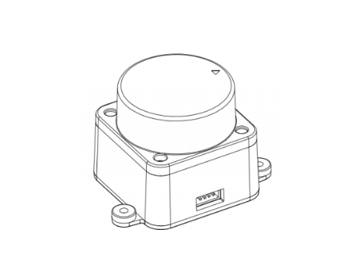
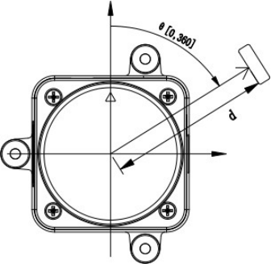

# Tutorial on LiDAR LD19

LD19 is a low cost LiDAR that we (LudovaTech team) used for the Robocup Junior competition. We find out that it works very well for our requirements but that there was no proper documentation or tutorial on the web. We succeeded to make it work after long days of work. Here is how we did it!

> [!TIP]
> This tutorial aims to guide you in retrieving LiDAR data from a microcontroller in a format that enables immediate processing onboard. If you just need to check that your LiDAR is working, [these documents](#links) provide instructions on using their software to view the data on your computer.

> [!NOTE]
> This is not an official documentation.
>
> All this documentation and code are licensed under CC BY-SA 4.0, with the exception of images and other files.

If you notice something missing or have any ideas, please feel free to open a [GitHub issue](https://github.com/LudovaTech/lidar-LD19-tutorial/issues/new).

## Overview



The LD19 LiDAR uses Direct Time-of-Flight (DTOF) technology, which measures the time interval between emitting and receiving a signal. According to the manufacturer’s documentation, the LD19 can perform up to 5,000 measurements per second.

> [!NOTE]
> In our application, we observed that one complete rotation of the LiDAR takes approximately 130 milliseconds, resulting in around 600 measurement points per loop.

## Communication interface

You can use a `JST ZH 4-pin` connector to link the LiDAR to other components, enabling both power supply and data reception. The interface details are outlined in the table below:

From left to right, holding the LiDAR with the circular part facing upwards.

| Name and Type |  Voltage  |   Comments   |
| :------------ | :-------: | :----------- |
| **Tx** (output UART), LiDAR data output at `230400` baud rate | 0V - 3.5V </br> typical: 3.3V | This LiDAR only sends data and does not receive any, hence the absence of an Rx port. |
| **PWM** (input), controls the speed of the built-in motor. Current LiDAR speed is indicated in the data sent | 0V - 3.3V | If manual control of the LiDAR speed is not required, the designated pin can be set to ground (GND) upon initiation of the LiDAR device and maintained in this state throughout its operation. (More informations on *manual* speed control in the [real documentation](#links))|
| **Ground** (power supply) | 0V | - |
| **5V** (power supply) | 4.5V - 5.5V </br> typical: 5V | - |

The LD19 uses UART protocol for data communication with the following settings:

- **Baud Rate:** 230400
- **Data Length:** 8 bits
- **Stop Bit:** 1
- **Parity:** None
- **Flow Control:** None

> [!TIP]
> For Arduino users, simply set the baud rate to `230400`. The other parameters are set to the correct values by default.

> [!IMPORTANT]
> The LD19 LiDAR starts transmitting measurement data as soon as its rotation stabilizes, which typically takes two to three seconds. There is no need to send any commands to initiate this process. In fact, you cannot send any commands to do so.

## Data protocol

### Data packet format

The LD19 uses one-way communication. Once it is operating stably, it begins to send measurement data packets automatically, without requiring any commands. There is 12 points per packet. The format of these measurement packets is illustrated in the table below.

|  Name  | Length | Type or Value | Description |
| :----: | :----: | :-----------: | :---------- |
| Header | 1 Byte | Always `0x54` | Indicating the start of the data packet |
| VerLen | 1 Byte | Always `0x2C` | The upper three bits of the byte specify the packet type, which is currently set to 1. The lower five bits represent the number of measurement points in a packet, which is fixed at 12. |
| Speed  | 2 Bytes | [least significant bit][LSB] before, </br> *unit: degrees per second* | Indicate the speed of the LiDAR |
| Start Angle | 2 Bytes | [least significant bit][LSB] before, </br> *unit: 0.01 degrees* | Indicate the starting angle of the data packet point |
| **Data** | 3 * 12 Bytes | ... | Please refer to the [next section](#understanding-data-packet) for further details. |
| End angle | 2 Bytes | [least significant bit][LSB] before, </br> *unit: 0.01 degrees* | Indicate the end angle of the data packet point |
| Timestamp | 2 Bytes | [least significant bit][LSB] before, </br> *unit: milliseconds*, </br> Reset to zero upon reaching `30000` | Indicating the timestamp value of the data packet |
| CRC check | 1 Bytes | Verification of all previous data *except itself* | Verifies data transfer for accuracy and completeness, ensuring error-free results. |

> [!IMPORTANT]
> We receive initial and final angles for every set of 12 points. The documentation advises using linear interpolation to determine the angles for each individual point. For detailed implementation steps, refer to the [Implementation section](#implementation). (Do not worry, it is very simple.)

### Understanding data packet

Each of the 12 mesurement points per packet is composed of 2 values :

|   Name   | Length  | Type or Value | Description |
| :------: | :-----: | :-----------: | :---------- |
| Distance | 2 Bytes | [least significant bit][LSB] before, </br> *unit: mm* | The distance to the detected point |
| Intensity | 1 Byte | reflects the light reflection intensity | Light intensity is positively correlated to the signal's intensity value. For a white object within 6 meters, the typical signal strength value is approximately 200. |

> [!NOTE]
> The LD19 employs a left-handed coordinate system with the rotation center at the origin. The front of the sensor is designated as the zero-degree direction, and the rotation angle increases clockwise, as illustrated in the figure below. </br>
> 

## Implementation

### Linear Interpolation

Linear interpolation is in this case a method of estimating values that lie between two known values. Here, it assumes that all points are at the same distance from each other.
All you need to do is:

- Calculate the distance `angleStep` between each point: `(endAngle - startAngle) / nbr_points`. `nbr_points` is always equal to 12 with this LiDAR.
- Calculate the angle for point `n` : `startAngle + (angleStep * n)`
- The calculations are actually slightly more complex than indicated in the documentation, particularly to handle the transition from 359° to 0°.

Here is our C++ implementation, which includes the 359° - 0° transition :

```c++
// Calculates the step size between startAngle and endAngle (in tenths of a degree),
// divided by lenMinusOne, which represents the number of steps minus one.
// Assumes angles are within 0 to 3599 (representing 0.0° to 359.9°).
uint16_t angleStep(uint16_t startAngle, uint16_t endAngle, unsigned int lenMinusOne) {
  if (startAngle <= endAngle) {
    return (endAngle - startAngle) / lenMinusOne;
  } else {
    return (36000 + endAngle - startAngle) / lenMinusOne;
  }
}

// Calculates the angle (in tenths of a degree) corresponding to a given step index,
// starting from startAngle, with each step being step tenths of a degree.
// Returns the angle wrapped within 0 to 3599 (representing 0.0° to 359.9°).
uint16_t angleFromStep(uint16_t startAngle, uint16_t step, unsigned int indice) {
  return (startAngle + (step * indice)) % 36000;
}
```

### Read a 2-Bytes value with least significant bit before

Here's how to interpret a 2-byte value (LSB/MSB) using an array called `buffer` that holds the bytes, with `index` indicating the position of the least significant bit (LSB, the first one).

```c++
uint16_t _get2BytesLsbMsb(byte buffer[], int index) {
  return (buffer[index + 1] << 8) | buffer[index];
}
```

### Implementing CRC check

Here is how to implement the CRC check to check data validity :
`p` is an array containing bytes retrieved from the lidar.
`lenWithoutCRCCheckValue` represents the total length of data sent by the LiDAR excluding the CRC check. For this lidar, it equals 44 bytes.

```c++
static const uint8_t crcTable[256] = {
    0x00, 0x4d, 0x9a, 0xd7, 0x79, 0x34, 0xe3,
    0xae, 0xf2, 0xbf, 0x68, 0x25, 0x8b, 0xc6, 0x11, 0x5c, 0xa9, 0xe4, 0x33,
    0x7e, 0xd0, 0x9d, 0x4a, 0x07, 0x5b, 0x16, 0xc1, 0x8c, 0x22, 0x6f, 0xb8,
    0xf5, 0x1f, 0x52, 0x85, 0xc8, 0x66, 0x2b, 0xfc, 0xb1, 0xed, 0xa0, 0x77,
    0x3a, 0x94, 0xd9, 0x0e, 0x43, 0xb6, 0xfb, 0x2c, 0x61, 0xcf, 0x82, 0x55,
    0x18, 0x44, 0x09, 0xde, 0x93, 0x3d, 0x70, 0xa7, 0xea, 0x3e, 0x73, 0xa4,
    0xe9, 0x47, 0x0a, 0xdd, 0x90, 0xcc, 0x81, 0x56, 0x1b, 0xb5, 0xf8, 0x2f,
    0x62, 0x97, 0xda, 0x0d, 0x40, 0xee, 0xa3, 0x74, 0x39, 0x65, 0x28, 0xff,
    0xb2, 0x1c, 0x51, 0x86, 0xcb, 0x21, 0x6c, 0xbb, 0xf6, 0x58, 0x15, 0xc2,
    0x8f, 0xd3, 0x9e, 0x49, 0x04, 0xaa, 0xe7, 0x30, 0x7d, 0x88, 0xc5, 0x12,
    0x5f, 0xf1, 0xbc, 0x6b, 0x26, 0x7a, 0x37, 0xe0, 0xad, 0x03, 0x4e, 0x99,
    0xd4, 0x7c, 0x31, 0xe6, 0xab, 0x05, 0x48, 0x9f, 0xd2, 0x8e, 0xc3, 0x14,
    0x59, 0xf7, 0xba, 0x6d, 0x20, 0xd5, 0x98, 0x4f, 0x02, 0xac, 0xe1, 0x36,
    0x7b, 0x27, 0x6a, 0xbd, 0xf0, 0x5e, 0x13, 0xc4, 0x89, 0x63, 0x2e, 0xf9,
    0xb4, 0x1a, 0x57, 0x80, 0xcd, 0x91, 0xdc, 0x0b, 0x46, 0xe8, 0xa5, 0x72,
    0x3f, 0xca, 0x87, 0x50, 0x1d, 0xb3, 0xfe, 0x29, 0x64, 0x38, 0x75, 0xa2,
    0xef, 0x41, 0x0c, 0xdb, 0x96, 0x42, 0x0f, 0xd8, 0x95, 0x3b, 0x76, 0xa1,
    0xec, 0xb0, 0xfd, 0x2a, 0x67, 0xc9, 0x84, 0x53, 0x1e, 0xeb, 0xa6, 0x71,
    0x3c, 0x92, 0xdf, 0x08, 0x45, 0x19, 0x54, 0x83, 0xce, 0x60, 0x2d, 0xfa,
    0xb7, 0x5d, 0x10, 0xc7, 0x8a, 0x24, 0x69, 0xbe, 0xf3, 0xaf, 0xe2, 0x35,
    0x78, 0xd6, 0x9b, 0x4c, 0x01, 0xf4, 0xb9, 0x6e, 0x23, 0x8d, 0xc0, 0x17,
    0x5a, 0x06, 0x4b, 0x9c, 0xd1, 0x7f, 0x32, 0xe5, 0xa8};

uint8_t _calCRC8FromBuffer(uint8_t* p, uint8_t lenWithoutCRCCheckValue) {
  uint8_t crc = 0xD8;                                       // pre-calculated header and verlen values (crc = crcTable[(crc ^ 0x54) & 0xff];crc = crcTable[(crc ^ 0x2C) & 0xff];)
  for (uint16_t i = 0; i < lenWithoutCRCCheckValue; i++) {  // ignores the last value of the p array (which contains the crc check value)
    crc = crcTable[(crc ^ *p++) & 0xff];
  }
  return crc;
}
```

To determine if the values are valid, just compare the output of this function with the data received from the lidar.

> [!CAUTION]
> In some LD19 LiDAR documentation documents, the crcTable is incomplete, resulting in its malfunctioning. This version includes all required lines of code.

### The complete C++ implementation for understanding data received from the lidar

`lidar_reader.h`

```c++
#ifndef LIDAR_H
#define LIDAR_H

#include <Arduino.h>

class LidarPoint {
 public:
  LidarPoint(uint16_t distance, uint8_t intensity, float angle);

  LidarPoint &operator=(const LidarPoint &) = delete;

  inline uint16_t distance() const { return _distance; }  // distance from the center of the lidar
  inline uint8_t intensity() const { return _intensity; }
  inline float angle() const { return _angle; }

  String toString() const;

 private:
  const uint16_t _distance;
  const uint8_t _intensity;
  const float _angle;
};

static const uint8_t crcTable[256] = {
    0x00, 0x4d, 0x9a, 0xd7, 0x79, 0x34, 0xe3,
    0xae, 0xf2, 0xbf, 0x68, 0x25, 0x8b, 0xc6, 0x11, 0x5c, 0xa9, 0xe4, 0x33,
    0x7e, 0xd0, 0x9d, 0x4a, 0x07, 0x5b, 0x16, 0xc1, 0x8c, 0x22, 0x6f, 0xb8,
    0xf5, 0x1f, 0x52, 0x85, 0xc8, 0x66, 0x2b, 0xfc, 0xb1, 0xed, 0xa0, 0x77,
    0x3a, 0x94, 0xd9, 0x0e, 0x43, 0xb6, 0xfb, 0x2c, 0x61, 0xcf, 0x82, 0x55,
    0x18, 0x44, 0x09, 0xde, 0x93, 0x3d, 0x70, 0xa7, 0xea, 0x3e, 0x73, 0xa4,
    0xe9, 0x47, 0x0a, 0xdd, 0x90, 0xcc, 0x81, 0x56, 0x1b, 0xb5, 0xf8, 0x2f,
    0x62, 0x97, 0xda, 0x0d, 0x40, 0xee, 0xa3, 0x74, 0x39, 0x65, 0x28, 0xff,
    0xb2, 0x1c, 0x51, 0x86, 0xcb, 0x21, 0x6c, 0xbb, 0xf6, 0x58, 0x15, 0xc2,
    0x8f, 0xd3, 0x9e, 0x49, 0x04, 0xaa, 0xe7, 0x30, 0x7d, 0x88, 0xc5, 0x12,
    0x5f, 0xf1, 0xbc, 0x6b, 0x26, 0x7a, 0x37, 0xe0, 0xad, 0x03, 0x4e, 0x99,
    0xd4, 0x7c, 0x31, 0xe6, 0xab, 0x05, 0x48, 0x9f, 0xd2, 0x8e, 0xc3, 0x14,
    0x59, 0xf7, 0xba, 0x6d, 0x20, 0xd5, 0x98, 0x4f, 0x02, 0xac, 0xe1, 0x36,
    0x7b, 0x27, 0x6a, 0xbd, 0xf0, 0x5e, 0x13, 0xc4, 0x89, 0x63, 0x2e, 0xf9,
    0xb4, 0x1a, 0x57, 0x80, 0xcd, 0x91, 0xdc, 0x0b, 0x46, 0xe8, 0xa5, 0x72,
    0x3f, 0xca, 0x87, 0x50, 0x1d, 0xb3, 0xfe, 0x29, 0x64, 0x38, 0x75, 0xa2,
    0xef, 0x41, 0x0c, 0xdb, 0x96, 0x42, 0x0f, 0xd8, 0x95, 0x3b, 0x76, 0xa1,
    0xec, 0xb0, 0xfd, 0x2a, 0x67, 0xc9, 0x84, 0x53, 0x1e, 0xeb, 0xa6, 0x71,
    0x3c, 0x92, 0xdf, 0x08, 0x45, 0x19, 0x54, 0x83, 0xce, 0x60, 0x2d, 0xfa,
    0xb7, 0x5d, 0x10, 0xc7, 0x8a, 0x24, 0x69, 0xbe, 0xf3, 0xaf, 0xe2, 0x35,
    0x78, 0xd6, 0x9b, 0x4c, 0x01, 0xf4, 0xb9, 0x6e, 0x23, 0x8d, 0xc0, 0x17,
    0x5a, 0x06, 0x4b, 0x9c, 0xd1, 0x7f, 0x32, 0xe5, 0xa8};

std::vector<LidarPoint> getPoints();

uint8_t _calCRC8FromBuffer(uint8_t *p, uint8_t lenWithoutCRCCheckValue);
uint16_t _get2BytesLsbMsb(byte buffer[], int index);

uint16_t angleStep(uint16_t startAngle, uint16_t endAngle, unsigned int lenMinusOne = 11);
uint16_t angleFromStep(uint16_t startAngle, uint16_t step, unsigned int indice);

#endif
```

`lidar_reader.cpp`

```c++
#include "lidar_reader.hpp"

//////LIDARPOINT

LidarPoint::LidarPoint(uint16_t distance, uint8_t intensity, float angle)
    : _distance(distance), _intensity(intensity), _angle(angle) {}

String LidarPoint::toString() const {
  String result = "(distance=";
  result += String(_distance);
  result += ", intensity=";
  result += String(_intensity);
  result += ", angle=";
  result += String(_angle);
  result += ")";
  return result;
}

//////FUNCTIONS

std::vector<LidarPoint> getPoints() {
  std::vector<LidarPoint> points;
  if (!SerialLidar.find("T,")) {  // equivalent en char de 84 44 (decimal)
    Serial.println("lidar_reader.getPoints : error, no header-verlen found in RX for the LiDAR LD19");
  } else {
    // The previous instruction (find) jumped to the beginning of the information
    // Now the stream is aligned
    byte buffer[45];
    size_t nbrBytesReceived = SerialLidar.readBytes(buffer, 45);
    if (nbrBytesReceived != 45) {
      Serial.println("lidar_reader.getPoints : error, wrong number of bytes received (" + String((uint32_t) nbrBytesReceived) + ")");
    } else {
      uint16_t speed = _get2BytesLsbMsb(buffer, 0);
      uint16_t startAngle = _get2BytesLsbMsb(buffer, 2);

      LidarPoint data[] = {// no for loop possible due to 'const' in LidarPoint class
                            LidarPoint(_get2BytesLsbMsb(buffer, 4), buffer[6], 0),
                            LidarPoint(_get2BytesLsbMsb(buffer, 7), buffer[9], 0),
                            LidarPoint(_get2BytesLsbMsb(buffer, 10), buffer[12], 0),
                            LidarPoint(_get2BytesLsbMsb(buffer, 13), buffer[15], 0),
                            LidarPoint(_get2BytesLsbMsb(buffer, 16), buffer[18], 0),
                            LidarPoint(_get2BytesLsbMsb(buffer, 19), buffer[21], 0),
                            LidarPoint(_get2BytesLsbMsb(buffer, 22), buffer[24], 0),
                            LidarPoint(_get2BytesLsbMsb(buffer, 25), buffer[27], 0),
                            LidarPoint(_get2BytesLsbMsb(buffer, 28), buffer[30], 0),
                            LidarPoint(_get2BytesLsbMsb(buffer, 31), buffer[33], 0),
                            LidarPoint(_get2BytesLsbMsb(buffer, 34), buffer[36], 0),
                            LidarPoint(_get2BytesLsbMsb(buffer, 37), buffer[39], 0)};

      uint16_t endAngle = _get2BytesLsbMsb(buffer, 40);
      uint16_t timestamp = _get2BytesLsbMsb(buffer, 42);
      uint8_t crcCheck = buffer[44];

      if (_calCRC8FromBuffer(buffer, 44) == crcCheck) {
        uint16_t step = angleStep(startAngle, endAngle);
        for (unsigned int i = 0; i < 12; i++) {
          points.push_back(
              LidarPoint(
                  data[i].distance(),
                  data[i].intensity(),
                  angleFromStep(startAngle, step, i)));
        }
      }
    }
  }
  return points;
}

uint8_t _calCRC8FromBuffer(uint8_t* p, uint8_t lenWithoutCRCCheckValue) {
  uint8_t crc = 0xD8;                                       // pre-calculated header and verlen values (crc = crcTable[(crc ^ 0x54) & 0xff];crc = crcTable[(crc ^ 0x2C) & 0xff];)
  for (uint16_t i = 0; i < lenWithoutCRCCheckValue; i++) {  // ignores the last value of the p array (which contains the crc check value)
    crc = crcTable[(crc ^ *p++) & 0xff];
  }
  return crc;
}

uint16_t _get2BytesLsbMsb(byte buffer[], int index) {
  return (buffer[index + 1] << 8) | buffer[index];
}

uint16_t angleStep(uint16_t startAngle, uint16_t endAngle, unsigned int lenMinusOne) {
  if (startAngle <= endAngle) {
    return (endAngle - startAngle) / lenMinusOne;
  } else {
    return (36000 + endAngle - startAngle) / lenMinusOne;
  }
}

uint16_t angleFromStep(uint16_t startAngle, uint16_t step, unsigned int indice) {
  return (startAngle + (step * indice)) % 36000;
}
```

To use the LD19 LiDAR with your board and this code, simply define `SerialLidar` (with `#define`) as the appropriate Serial object for your board. Then, call the `getPoints` function to receive a `std::vector` containing all detected points from the lidar.

You can find all our source code available at [this location](https://github.com/LudovaTech/robot-prog-public).

## Links

- [What seems to be the official documentation](https://wiki.youyeetoo.com/en/Lidar/D300) ***Contains errors***
- [A better documentation.](https://www.elecrow.com/download/product/SLD06360F/LD19_Development%20Manual_V2.3.pdf) ([local version](./documents/LD19_Development_Manual_v2.5.pdf) if the website removes the document)

<p xmlns:cc="http://creativecommons.org/ns#" xmlns:dct="http://purl.org/dc/terms/"><a property="dct:title" rel="cc:attributionURL" href="https://github.com/LudovaTech/lidar-LD19-tutorial">lidar-LD19-tutorial</a> (only the text and code of this document, not the images or the other files) by <a rel="cc:attributionURL dct:creator" property="cc:attributionName" href="https://github.com/LudovaTech">LudovaTech (D'Artagnant)</a> is licensed under <a href="https://creativecommons.org/licenses/by-sa/4.0/?ref=chooser-v1" target="_blank" rel="license noopener noreferrer" style="display:inline-block;">CC BY-SA 4.0</a></p>

[LSB]: https://en.wikipedia.org/wiki/Bit_numbering
